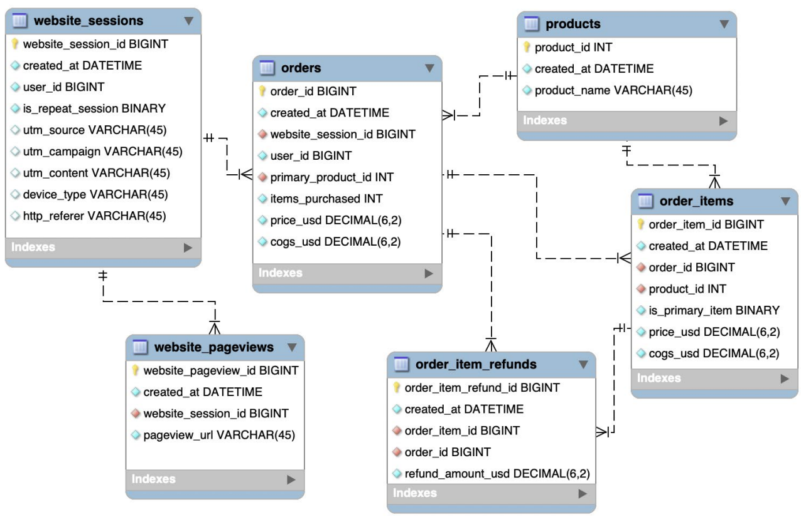

## About the Project

- MySQL Database Administration: Beginner SQL Database Design
- Learn Database Design with MySQL Workbench. SQL DBA for Beginners: A Relational Database Management System Introduction.
- Maven Analytics

&nbsp;

---

&nbsp;

## Basics

|             Course             |                                                    Outline                                                    |
| :----------------------------: | :-----------------------------------------------------------------------------------------------------------: |
|      Introduction & Setup      | Discuss relational databases, download MySQL Community Server and Workbench, and create the project databases |
|   Creating Schemas & Tables    |      Create and delete schemas, tables, and columns using the Workbench Editor, and by running SQL code       |
| Inserting, Updating & Deleting |     Insert data into tables, and update or delete specific records based on logical criteria you specify      |
|        Database Design         |     Learn about table relationships, primary and foreign keys, and 4 how to properly normalize a database     |
|     Advanced DBA Concepts      |  Create stored procedures, triggers, and indexes, and learn how to implement unique and non-NULL constraints  |
|  Managing Users & Permissions  |       Grant access to additional users and prescribe what they can 6 and cannot do within the database        |

&nbsp;

---

&nbsp;

- <b>Scenario: </b>You have just been hired by a small database consulting shop. You will be working on projects for various clients to help them get their databases built and optimized for business
- <b>Brief: </b>As a member of the consulting team, you will be asked to perform database services for various clients. Sometimes you will work with existing databases and tables to make small improvements, and other times you will need to set up a database for clients from the ground up
- <b>Objective: </b>
  - Create databases and tables your clients will need to run their businesses
  - Use your knowledge of database best practices to implement and optimize database design principles
  - Update records, create indexes, triggers, and stored procedures, and manage users and permissions
- Relational databases consist of data stored in multiple tables
- Relational database management systems (RDBMS) serve as an interface to access and manage relational databases, using SQL
- RDBMS administrators can grant access to users and set specific roles and permissions

&nbsp;

---

&nbsp;

> <b>Bruna: </b>Safe Mode

> <b>John: </b>It's up to you whether you use safe mode or not. I would call this a matter of your personal comfort.
>
> 1. Do what you did here. Disable safe mode.
>
> 2. Include the primary key in a WHERE condition. What if you're updating all records? No problem! You can do the following...
>
> WHERE employee_id > 0
>
> ...this would still perform the action on all records (the WHERE clause doesnt filter any out), but it technically incorporates the PK so safe mode is still happy.
>
> You can leave safe mode on or disable it like you did. Some people like having that error warning as an extra reminder to check their work and make sure they aren't doing something dangerous with the UPDATE. Others think this is a silly extra step.
>
> Totally up to you.

&nbsp;

---

&nbsp;

- <b>Truncate Table: </b>
  - If we want to remove all records from a table but preserve the table structure, we can do that using TRUNCATE TABLE
  - When we use TRUNCATE TABLE, the data is removed but the column names, data types, column order, and any constraints placed on the table are all preserved
  - TRUNCATE TABLE is very similar to using DELETE without a WHERE clause but you cannot ROLLBACK

|         Languages          |     |                                                                                |
| :------------------------: | :-: | :----------------------------------------------------------------------------: |
|  DATA DEFINITION LANGUAGE  | DDL | Used to query data (often considered part of DML) Examples: SELECT, SHOW, HELP |
| DATA MANIPULATION LANGUAGE | DML |  Used to add, modify, or delete data records Examples: INSERT, UPDATE, DELETE  |
|    DATA QUERY LANGUAGE     | DQL | Used to query data (often considered part of DML) Examples: SELECT, SHOW, HELP |
|   DATA CONTROL LANGUAGE    | DCL |          Used to grant and revoke permissions Examples: GRANT, REVOKE          |
| DATA TRANSACTION LANGUAGE  | DTL |   Used to manage transactions Examples: START TRANSACTION, COMMIT, ROLLBACK    |

&nbsp;

---

&nbsp;

## Database Design

- <b>Cardinality</b> refers to the uniqueness of values in a column (or attribute) of a table and is commonly used to describe how two tables relate (one-to-one, one-to-many, or many-to-many).
- <b>Primary keys</b> are unique
  - They cannot repeat, so there is only one instance of each primary key value in a column
- <b>Foreign keys</b> are non-unique
  - They can repeat, so there may be many instances of each foreign key value in a column
- We can create a <b>one-to-many</b> relationship by connecting a <b>foreign key</b> in one table to
  a <b>primary key</b> in another

- <b>Normalization</b> is the process of structuring the tables and columns in a relational database to <b>minimize redundancy</b> and <b>preserve data integrity</b>. - Benefits of normalization include:
  - <b>Eliminating duplicate data</b> (this makes storage and query processing more efficient)
  - <b>Reducing errors and anomalies</b> (restrictions around data structure help to prevent human errors)
- <b>Enhanced Entity Relationship (EER) Models</b>
  - Which tables are in the database
  - Which columns exist in each table
  - The data types of the various columns
  - Primary and foreign keys within tables
  - Relationship cardinality between tables
  - Constraints on columns (i.e. Non-NULL)
- [What do the mysql workbench column icons mean](https://stackoverflow.com/questions/10778561/what-do-the-mysql-workbench-column-icons-mean)

&nbsp;

---

&nbsp;
