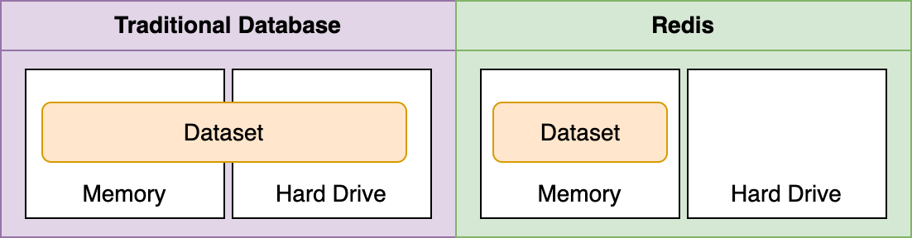
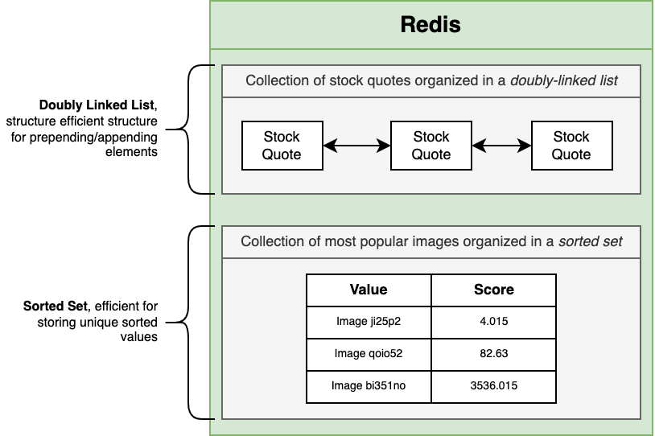
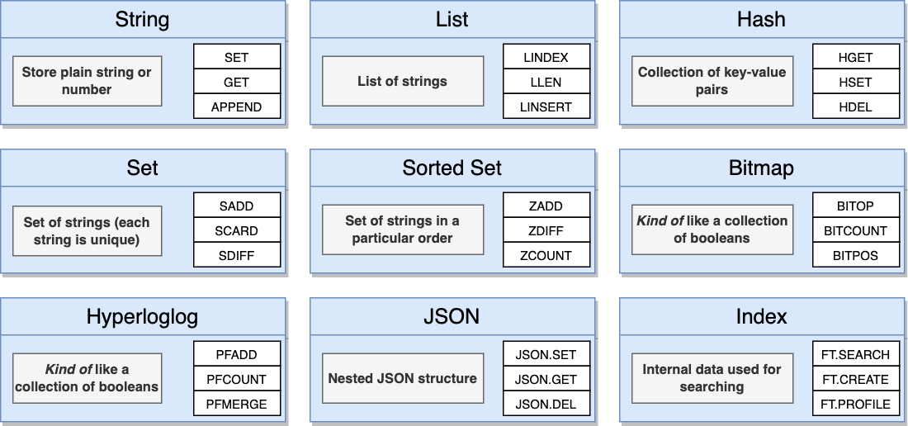
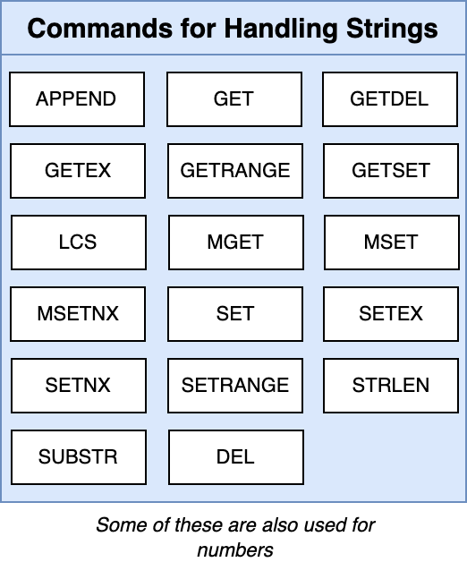
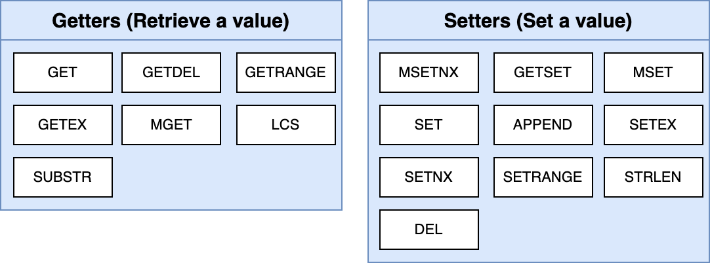
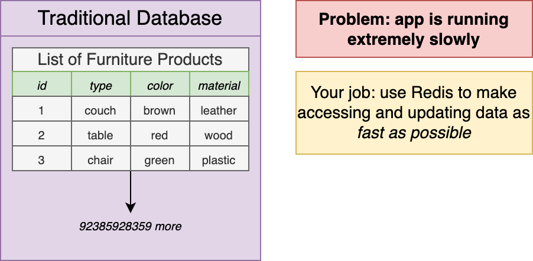
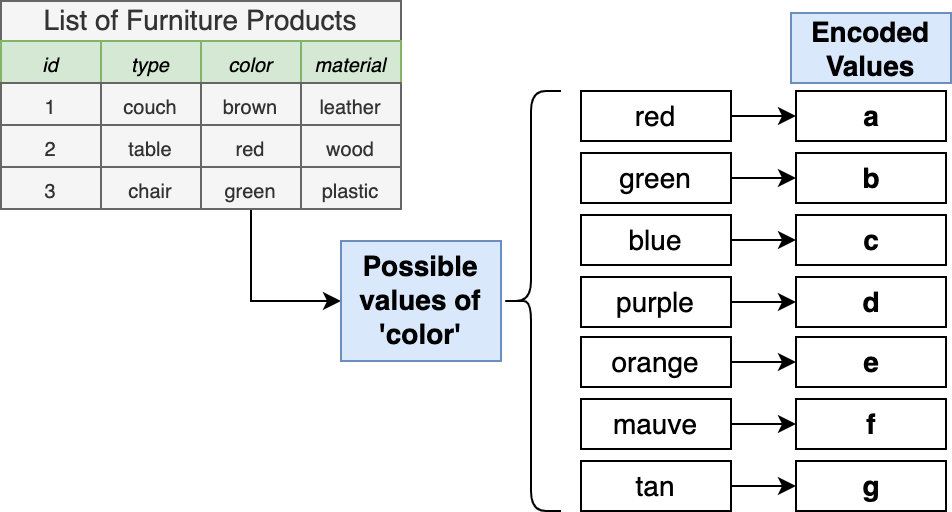
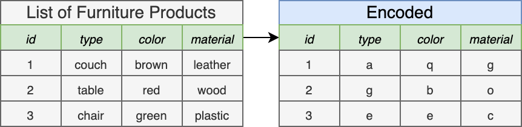
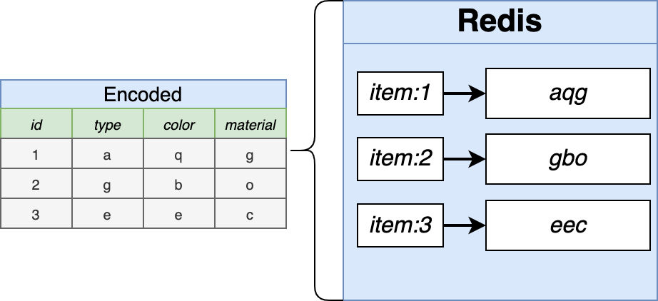
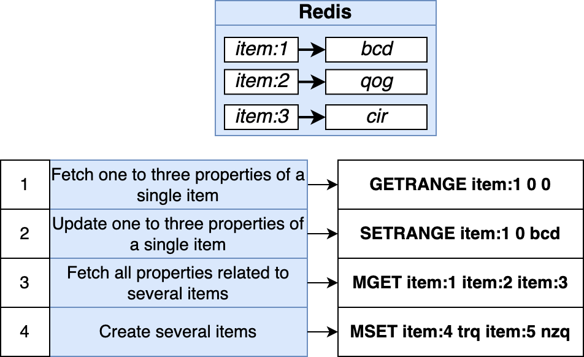

## About The Project

- Redis: The Complete Developer's Guide
- Master Redis v7.0 with hands-on exercises. Includes Modules, Scripting, Concurrency, and Streams!
- [Stephen Grider](https://github.com/StephenGrider)

&nbsp;

---

&nbsp;

## Introduction

### Redis

- **Why is Redis fast?**
  - All data is stored in memory
  - Data is organized in simple data structure
  - Redis has a simple feature set
- **Trade-off:** It is more expensive to store in memory

&nbsp;



&nbsp;



|  Traditional Database Feature Set  | Redis Feature Set |
| :--------------------------------: | :---------------: |
|        Enforced data schema        |   ...Not much!    |
|              Triggers              |                   |
|      Foreign key constraints       |                   |
| Uniqueness of arbitrary properties |                   |
|            SQL Support             |                   |
|        Transaction rollback        |                   |

### Setup

- [redis.com](https://redis.com/)
- [rbook](http://rbook.cloud/)
- Config
  - `Public endpoint`: `Host` and `Port`
  - `Default user password`: `Password`

```sh
SET key value
SET message 'Hi there'
GET message
```

### Commands

- [redis.io - Commands](https://redis.io/commands/)



&nbsp;



&nbsp;



&nbsp;

- Why would we ever want to replace part of a string?

&nbsp;



&nbsp;



&nbsp;



&nbsp;



&nbsp;



&nbsp;

---

&nbsp;
