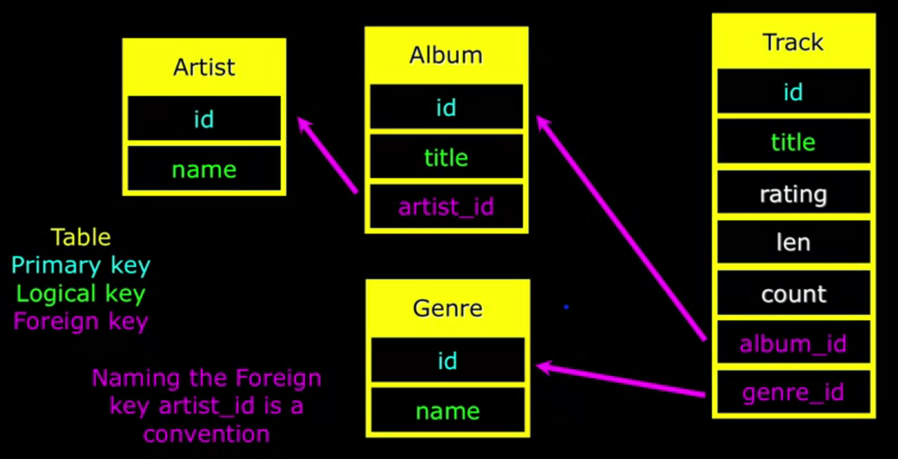
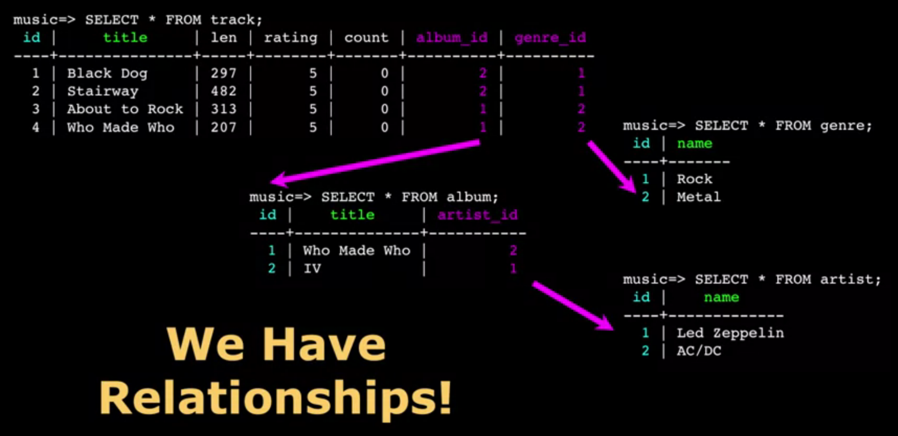

- [About The Project](#about-the-project)
- [Module 1](#module-1)
  - [Terminology](#terminology)
  - [CLI](#cli)
- [Module 2](#module-2)
  - [Query Planner and Optimizer](#query-planner-and-optimizer)
  - [Data Types](#data-types)
  - [Database Keys and Indexes](#database-keys-and-indexes)
  - [Musical Track Database](#musical-track-database)
- [Module 3](#module-3)
  - [Building a Data Model](#building-a-data-model)
  - [Three Kinds of Keys](#three-kinds-of-keys)
  - [Database Normalization (3NF)](#database-normalization-3nf)
  - [Building Tables](#building-tables)
  - [Relational Power](#relational-power)

# About The Project

- [Database Design and Basic SQL in PostgreSQL](https://www.coursera.org/learn/database-design-postgresql/)

# Module 1

## Terminology

- **Database**: contains one or more tables
- **Relation (or table)**: contains tuples and attributes
- **Tuple (or row)**: a set of fields which generally represent an "object" like a person or a music track
- **Attribute (also column or field)**: one of possibly many elements of data corresponding to the object represented by the row

## CLI

```sh
# '#' sign means super user
psql -U postgres
psql postgres

# List database
\l

# Creating a User
CREATE USER pg4e WITH PASSWORD 'secret';
# Creating a Database
CREATE DATABASE people WITH OWNER 'pg4e';
\q

# Connecting to a Database
psql people pg4e
# Did not find any relations.
\dt

# Create a table
CREATE TABLE users(
  name VARCHAR(128),
  email VARCHAR(128)
);
\dt
\d+ users
```

# Module 2

## Query Planner and Optimizer

PostgreSQL’s query planner and optimizer are designed to avoid looping through millions of rows in a brute-force way. Here’s a brief look at how PostgreSQL optimizes this process:

- **Indexes**: PostgreSQL uses indexes to speed up queries. When you have an index on a column, the database can quickly locate rows that match the WHERE clause without scanning every row. This is similar to looking up a word in an index of a book rather than reading each page.
- **Query Planning**: PostgreSQL’s query planner evaluates multiple potential execution paths to find the most efficient one. It considers factors like table size, available indexes, and joins, then chooses a strategy that minimizes the data that needs to be scanned.
- **Execution Plans**: PostgreSQL uses different types of scans, such as:
  - **Sequential Scans**: Reading the entire table row by row, used when no indexes exist or the table is small.
  - **Index Scans**: Utilizing an index to directly locate rows that satisfy the WHERE clause.
  - **Bitmap Index Scans**: Combining multiple indexes to quickly find rows in large tables.
  - **Joins**: For joins, it evaluates strategies like nested loops, hash joins, and merge joins to determine the fastest way to combine tables based on the query.
  - **Caching**: Frequently accessed data can be cached in memory, reducing the need to read from disk repeatedly.
  - **Parallelism**: For large datasets, PostgreSQL can leverage parallel processing to split tasks among multiple CPU cores, reducing query execution time.

```sql
INSERT INTO users (name, email) VALUES ('Ted', 'ted@umich.edu');
DELETE FROM users WHERE email='ted@umich.edu';
UPDATE users SET name='Charles' WHERE email='csev@umich.edu';
SELECT * FROM users WHERE email='csev@umich.edu';
SELECT * FROM users ORDER BY email;
SELECT * FROM users WHERE name LIKE '%e%';
SELECT * FROM users ORDER BY email OFFSET 1 LIMIT 2;
SELECT COUNT(*) FROM users WHERE email='csev@umich.edu'
```

## Data Types

[Chapter 8. Data Types](https://www.postgresql.org/docs/current/datatype.html)

## Database Keys and Indexes

```sql
DROP TABLE users;

-- AUTO_INCREMENT
CREATE TABLE users (
  id SERIAL,
  name VARCHAR(128),
  email VARCHAR(128) UNIQUE,
  PRIMARY KEY(id)
);
```

- [Chapter 9. Functions and Operators](https://www.postgresql.org/docs/current/functions.html)

- A **B-tree** is a tree data structure that keeps data sorted and allows searches, sequential access, insertions, and deletions in logarithmic amortized time. The B-tree is optimized for systems that read and write large blocks of data. It is commonly used in databases and file systems.
- A **hash** function is any algorithm or subroutine that maps large data sets to smaller data sets, called keys. For example, a single integer can serve as an index to an array (cf. associative array). The values returned by a hash function are called hash values, hash codes. hash sums. checksums, or simply hashes. Hash functions are mostly used to accelerate table lookup or data comparison tasks such as finding items in a database.

## Musical Track Database

```sh
# iTunes library in comma-separated-values (CSV)
wget https://www.pg4e.com/tools/sql/library.csv

# load it into the track_raw table
\copy track_raw(title,artist,album,count,rating,len) FROM 'library.csv' WITH DELIMITER ',' CSV;

# To grade this assignment, the program will run a query like this on your database
SELECT title, album FROM track_raw ORDER BY title LIMIT 3;
```

# Module 3

## Building a Data Model

- Drawing a picture of the data objects for our application and then figuring out how to represent the objects and their relationships.
- **Basic Rule**: Don't put the same string data in twice - use a relationship instead.
- When there is one thing in the "real world" there should only be one copy of that thing in the database.

## Three Kinds of Keys

- **Primary Key**: Generally an integer auto-increment field.
  - Never use your logical key as the primary key.
  - Logical keys can and do change, albeit slowly.
  - Relationships that are based on matching string fields are less efficient than integers.
- **Logical Key**: What the outside world uses for lookup.
- **Foreign Key**: Generally an integer key pointing to a row in another table.
  - A foreign key is when a table has a column containing a key that points to the primary key of another table.
  - When all primary keys are integers, then all foreign keys are integers. This is good - very good.

## Database Normalization (3NF)

- There is _tons_ of database theory - way too much to understand without excessive predicate calculus.
- **Do not replicate data**. Instead, reference data. Point at data.
- Use **integers for keys** and for references.
- Add a special "key" column to each table, which you will make references to.



## Building Tables

```sh
psql -d postgres

# Create TABLEs
psql music
# Describe track
\d track
```

## Relational Power

- By removing the replicated data and replacing it with references to a single copy of each bit of data, we build a "web" of information that the relational database can read through very quickly - even for very large amounts of data.
- Often when you want some data it comes from a number of tables linked by these foreign keys.
- The `JOIN`operation links across several tables as part of a `SELECT` operation.
- You must tell the `JOIN` how to use the keys that make the connection between the tables using an `ON CLAUS`


