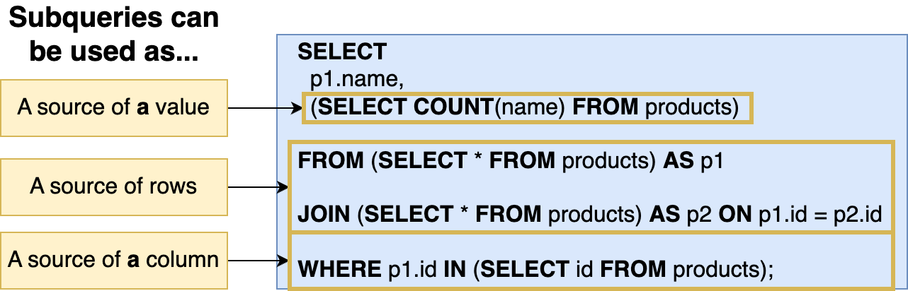
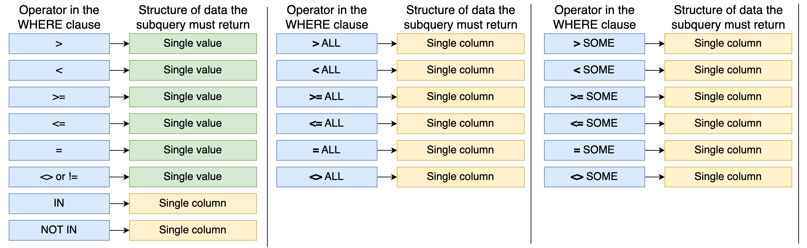
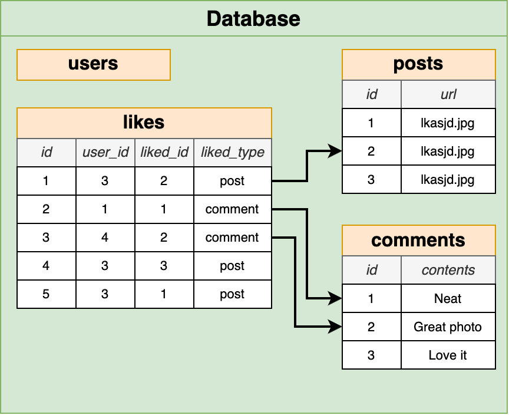
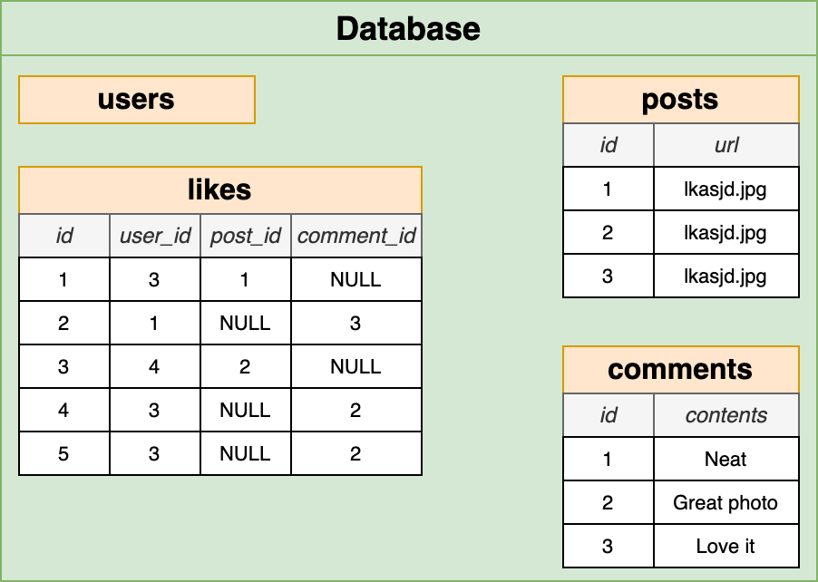
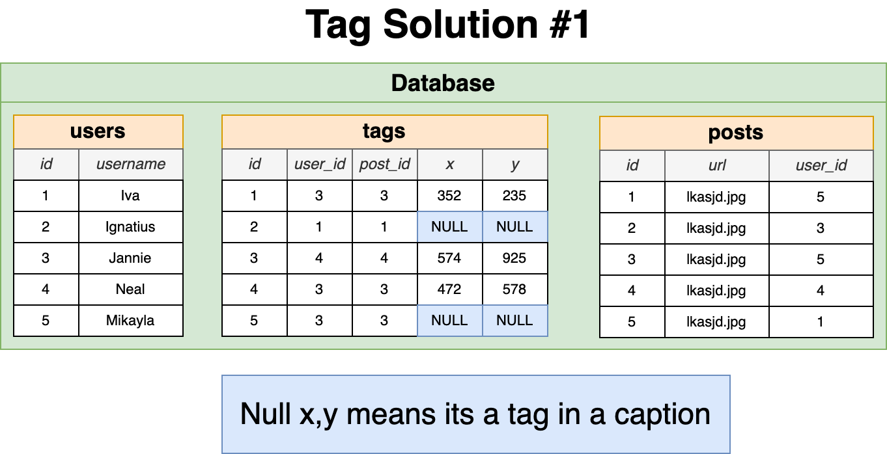

- [About The Project](#about-the-project)
- [Introduction](#introduction)
- [Database Design](#database-design)
- [Joins \& Aggregations](#joins--aggregations)
- [Unions \& Intersections with Sets](#unions--intersections-with-sets)
- [Assembling Queries with SubQueries](#assembling-queries-with-subqueries)
- [PGAdmin](#pgadmin)
- [PostgreSQL](#postgresql)
  - [Validation](#validation)
- [Instagram](#instagram)
  - [Likes](#likes)
  - [Tags](#tags)

&nbsp;

# About The Project

- SQL and PostgreSQL: The Complete Developer's Guide
- Become an expert with SQL and PostgreSQL! Store and fetch data, tune queries, and design efficient database structures!
- [Stephen Grider](https://github.com/StephenGrider)
- [pg-sql](https://pg-sql.com/)

&nbsp;

# Introduction

- **Challenges of PostgreSQL**
  - Writing efficient queries to retrieve information
  - Designing the schema, or structure, of the database
  - Understanding when to use advanced features
  - Managing the database in a production environment
    - Backup
    - Scaling
- **Database Design Process**
  - What kind of thing are we storing?
  - What properties does this thing have?
  - What type of data does each of those properties contain?
- **Table**: Collection of records
- **Columns**: Each column records one property about a thing
- **Rows**
- SQL can transform data before we retrieve them from a table
- **Relationships**
  - One-to-One
  - Many-to-Many
- **Primary Key**: Uniquely identifies this record in this table
- **Foreign Key**: Identifies a record (usually in another table) that this row is associated with

|                      Primary Keys                      |                        Foreign Keys                        |
| :----------------------------------------------------: | :--------------------------------------------------------: |
|      Each row in every table has one primary key       |    Rows only have this if they belong to another record    |
| No other row in the same table can have the same value | Many rows in the same table can have the same foreign keys |
|              99% of the time called 'id'               |    Name varies, usually called something like 'xyz_id'     |
|              Either an integer or a UUID               |   Exactly equal to the primary key of the referenced row   |
|                   Will never change                    |          Will change if the relationship changes           |

&nbsp;

# Database Design

- **Database For a Photo-Sharing App**
  - users
  - photos
  - comments
  - likes
- **What Tables Should We Make?**
  - Common features (like authentication, comments, etc) are frequently built with conventional table names and columns
  - What type of resources exist in your app? Create aa separate table for each of these features
  - Features that seem to indicate a relationship or ownership between two types of resources need to be reflected in our table design

&nbsp;

# Joins & Aggregations

- **The more tables we have, the more interesting questions we can answer**
  - Find all the comments for the photo with ID = 3, along with the username of the comment author
  - Find the **average number of comments** per photo
  - Find the photo with the **most comments** attached to it
  - Find the photo with ID = 10 and get the **number of comments** attached to it
  - Find the user with the most activity (most comments + most photos)
  - Calculate the **average number of characters** per comment
- **Joins**:
  - Produces values by merging together rows from different related tables
  - Use a join most times that you're asked to find data that involves multiple resources
- **Aggregation**:
  - Looks at many rows and calculates a single value
  - Words like **'most'**, **'average'**, **'least'** are a sign that you need to use an aggregation

&nbsp;

# Unions & Intersections with Sets

- **`UNION`** - Join together the results of two queries. Remove duplicates
- **`UNION ALL`** - Join together results of two queries
- **`INTERSECT`** - Find the rows common in the results of two queries. Remove duplicates
- **`INTERSECT ALL`** - Find the rows common in the results of two queries
- **`EXCEPT`** - Find the rows that are present in first query but not second query. Remove duplicates
- **`EXCEPT ALL`** - Find the rows that are present in first query but not second query

&nbsp;

# Assembling Queries with SubQueries



&nbsp;



&nbsp;

# PGAdmin

- Tool to manage and inspect a Postgres database
- Can connect to local or remote databases
- Can view/change just about anything in PG
- A PG Server can contain multiple databases
- All data for a single app lives in a single DB
- Having multiple DB's is more about working with more than one app on your machine

&nbsp;

# PostgreSQL

- [Data Types](https://www.postgresql.org/docs/current/datatype.html)
- [Time Zones](https://www.postgresql.org/docs/current/datatype-datetime.html#DATATYPE-TIMEZONES)

| Data to Store                                                                       | Condition                                                                           | Data Type        |
| ----------------------------------------------------------------------------------- | ----------------------------------------------------------------------------------- | ---------------- |
| 'id' column of any table                                                            | -                                                                                   | serial           |
| Need to store a number without a decimal                                            | -                                                                                   | integer          |
| Bank balance, grams of gold, scientific calculations                                | Need to store a number with a decimal and this data needs to be very accurate       | numeric          |
| Kilograms of trash in a landfill, liters of water in a lake, air pressure in a tire | Need to store a number with a decimal and the decimal doesn't make a big difference | double precision |

## Validation

- Row-Level Validation
- Multi-Column Uniqueness
- Checks Over Multiple Columns
- Validation at web server or database?

|                    Web Server                     |                               Database                               |
| :-----------------------------------------------: | :------------------------------------------------------------------: |
|     Easier to express more complex validation     | Validation still applied even if you connect with a different client |
|     Far easier to apply new validation rules      |             Guaranteed that validation is always applied             |
| Many libraries to handle validation automatically | Can only apply new validation rules if all existing rows satisfy it  |

&nbsp;

# Instagram

## Likes

- **Rules**
  - Each user can like a specific post a single time
  - A user should be able to 'unlike' a post
  - Need to be able to figure out how many users like a post
  - Need to be able to list which users like a post
  - Something besides a post might need to be liked (comments, maybe?)
  - We might want to think about 'dislikes' or other kinds of reactions
- **Do not add a 'likes' Column to Posts**
  - No way to make sure a user likes a post only once
  - No way to make sure a user can only 'unlike' a post they have liked
  - No way to figure out which users like a particular post
  - No way to remove a like if a user gets deleted



- **Polymorphic Association**
  - A like can be a 'post like' or a 'comment like'
  - Not recommended, but you'll still see it in use
  - Requires your app to figure out the meaning of each like
  - Can't use foreign key columns - `liked_id` is a plain integer



- **Polymorphic Association alternative implementation**
  - Each possible type of relation gets its own FK column
  - We'd still want to make sure either `post_id` or `comment_id` is not `NULL`

```sql
Add CHECK of (
  COALESCE((post_id)::BOOLEAN::INTEGER, 0) + COALESCE((comment_id)::BOOLEAN::INTEGER, 0)
) = 1
```

- **Using Additional Tables**
  - Each type of like gets its own table
  - Still want to write queries that will count up all likes? You can use a Union or a View

## Tags



&nbsp;


- Do you expect to query for `caption_tags` and `photo_tags` at different rates?
- Will the meaning of a `photo_tags` change at some point?

&nbsp;
