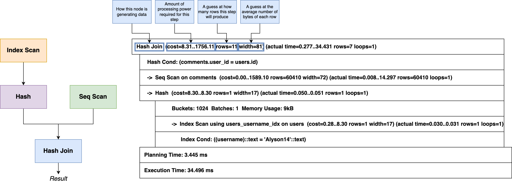
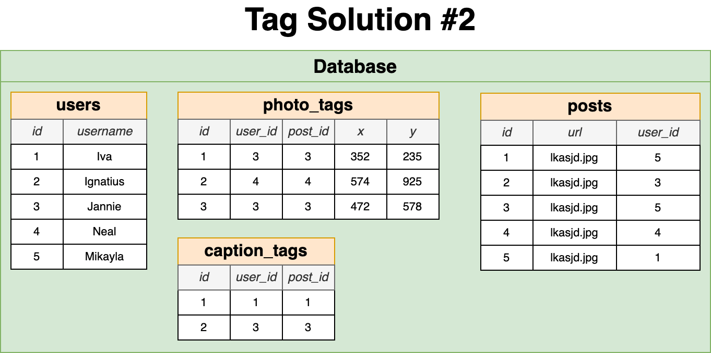

- [About The Project](#about-the-project)
- [Introduction](#introduction)
- [Database Design](#database-design)
- [SQL](#sql)
  - [Joins \& Aggregations](#joins--aggregations)
  - [Unions \& Intersections with Sets](#unions--intersections-with-sets)
  - [Assembling Queries with SubQueries](#assembling-queries-with-subqueries)
  - [Common Table Expression (CTE)](#common-table-expression-cte)
- [PGAdmin](#pgadmin)
- [PostgreSQL](#postgresql)
  - [Validation](#validation)
  - [Where does Postgres store data?](#where-does-postgres-store-data)
  - [Indexing](#indexing)
- [Query Tuning](#query-tuning)
  - [Basic](#basic)
  - [Advance](#advance)
- [Instagram](#instagram)
  - [Likes](#likes)
  - [Tags](#tags)
  - [Posts](#posts)
  - [Seed Database](#seed-database)

 

# About The Project

- SQL and PostgreSQL: The Complete Developer's Guide
- Become an expert with SQL and PostgreSQL! Store and fetch data, tune queries, and design efficient database structures!
- [Stephen Grider](https://github.com/StephenGrider)
- [pg-sql](https://pg-sql.com/)

 

# Introduction

- **Challenges of PostgreSQL**
  - Writing efficient queries to retrieve information
  - Designing the schema, or structure, of the database
  - Understanding when to use advanced features
  - Managing the database in a production environment
    - Backup
    - Scaling
- **Database Design Process**
  - What kind of thing are we storing?
  - What properties does this thing have?
  - What type of data does each of those properties contain?
- **Table**: Collection of records
- **Columns**: Each column records one property about a thing
- **Rows**
- SQL can transform data before we retrieve them from a table
- **Relationships**
  - One-to-One
  - Many-to-Many
- **Primary Key**: Uniquely identifies this record in this table
- **Foreign Key**: Identifies a record (usually in another table) that this row is associated with

|                      Primary Keys                      |                        Foreign Keys                        |
| :----------------------------------------------------: | :--------------------------------------------------------: |
|      Each row in every table has one primary key       |    Rows only have this if they belong to another record    |
| No other row in the same table can have the same value | Many rows in the same table can have the same foreign keys |
|              99% of the time called 'id'               |    Name varies, usually called something like 'xyz_id'     |
|              Either an integer or a UUID               |   Exactly equal to the primary key of the referenced row   |
|                   Will never change                    |          Will change if the relationship changes           |

 

# Database Design

- **Database For a Photo-Sharing App**
  - users
  - photos
  - comments
  - likes
- **What Tables Should We Make?**
  - Common features (like authentication, comments, etc) are frequently built with conventional table names and columns
  - What type of resources exist in your app? Create aa separate table for each of these features
  - Features that seem to indicate a relationship or ownership between two types of resources need to be reflected in our table design

 

# SQL

## Joins & Aggregations

- **The more tables we have, the more interesting questions we can answer**
  - Find all the comments for the photo with ID = 3, along with the username of the comment author
  - Find the **average number of comments** per photo
  - Find the photo with the **most comments** attached to it
  - Find the photo with ID = 10 and get the **number of comments** attached to it
  - Find the user with the most activity (most comments + most photos)
  - Calculate the **average number of characters** per comment
- **Joins**:
  - Produces values by merging together rows from different related tables
  - Use a join most times that you're asked to find data that involves multiple resources
- **Aggregation**:
  - Looks at many rows and calculates a single value
  - Words like **'most'**, **'average'**, **'least'** are a sign that you need to use an aggregation

## Unions & Intersections with Sets

- **`UNION`** - Join together the results of two queries. Remove duplicates
- **`UNION ALL`** - Join together results of two queries
- **`INTERSECT`** - Find the rows common in the results of two queries. Remove duplicates
- **`INTERSECT ALL`** - Find the rows common in the results of two queries
- **`EXCEPT`** - Find the rows that are present in first query but not second query. Remove duplicates
- **`EXCEPT ALL`** - Find the rows that are present in first query but not second query

## Assembling Queries with SubQueries


 


 

## Common Table Expression (CTE)

- **Simple**
  - Readability
  - Don't have to use a `UNION` keyword
- **Recursive**
  - Useful anytime you have a **tree or graph-type data structure**
  - Must use a `UNION` keyword

 


 


 

# PGAdmin

- Tool to manage and inspect a Postgres database
- Can connect to local or remote databases
- Can view/change just about anything in PG
- A PG Server can contain multiple databases
- All data for a single app lives in a single DB
- Having multiple DB's is more about working with more than one app on your machine

 

# PostgreSQL

- [Data Types](https://www.postgresql.org/docs/current/datatype.html)
- [Time Zones](https://www.postgresql.org/docs/current/datatype-datetime.html#DATATYPE-TIMEZONES)

| Data to Store                                                                       | Condition                                                                           | Data Type        |
| ----------------------------------------------------------------------------------- | ----------------------------------------------------------------------------------- | ---------------- |
| 'id' column of any table                                                            | -                                                                                   | serial           |
| Need to store a number without a decimal                                            | -                                                                                   | integer          |
| Bank balance, grams of gold, scientific calculations                                | Need to store a number with a decimal and this data needs to be very accurate       | numeric          |
| Kilograms of trash in a landfill, liters of water in a lake, air pressure in a tire | Need to store a number with a decimal and the decimal doesn't make a big difference | double precision |

## Validation

- Row-Level Validation
- Multi-Column Uniqueness
- Checks Over Multiple Columns
- Validation at web server or database?

|                    Web Server                     |                               Database                               |
| :-----------------------------------------------: | :------------------------------------------------------------------: |
|     Easier to express more complex validation     | Validation still applied even if you connect with a different client |
|     Far easier to apply new validation rules      |             Guaranteed that validation is always applied             |
| Many libraries to handle validation automatically | Can only apply new validation rules if all existing rows satisfy it  |

## Where does Postgres store data?

- [Database Page Layout](https://www.postgresql.org/docs/current/storage-page-layout.html)

|       Term        |                                                   Description                                                    |
| :---------------: | :--------------------------------------------------------------------------------------------------------------: |
| Heap or Heap File |                                 File that contains all data (rows) of our table                                  |
|   Tuple or Item   |                                          Individual row from the table                                           |
|   Block or Page   | The heap file is divided into many different 'blocks' or 'pages'.</br>Each page/block stores some number of rows |


&nbsp;


&nbsp;


&nbsp;


&nbsp;

---

&nbsp;

**Full Table Scan in PostgreSQL**

1. **What is a Full Table Scan?**

   - A full table scan occurs when the PostgreSQL query planner decides to read the entire contents of a table to fulfill a query. This happens when it determines that using indexes would be less efficient or when no suitable indexes are available.

2. **Impact on Performance**

   - Full table scans can be resource-intensive, especially for large tables, as they involve reading every row in the table. This can lead to increased I/O, higher CPU usage, and longer query execution times.
   - If full table scans are frequent, they can significantly degrade overall database performance, particularly if the table is large or accessed frequently.

3. **Avoidance Strategies**
   - **Indexing:** Proper indexing is key to avoiding unnecessary full table scans. Creating indexes on columns used in WHERE, JOIN, ORDER BY, and GROUP BY clauses can help.
   - **Query Optimization:** Writing efficient queries, such as avoiding SELECT \*, can reduce the need for full table scans.
   - **Partitioning:** For very large tables, partitioning can help by breaking the data into smaller, more manageable pieces.

**Best Practices and Version Updates**

To stay updated with the latest changes and optimizations in each PostgreSQL version, it's advisable to regularly check the official PostgreSQL release notes and documentation. Additionally, tuning database parameters and regularly monitoring query performance can help in identifying and mitigating performance issues related to full table scans.

## Indexing

- **Index**: Data structure that efficiently tells us what block/index a record is stored at

  1. Which column do we want to have very fast lookups on? `username`
  2. Extract only the property we want to do fast lookups by and the block/index for each
  3. Sort in some meaningful way (Alphabetical for text, value for numbers, etc)
  4. Organize into a tree data structure. Evenly distribute values in the leaf nodes, in order left to right

- **Downside**
  - Can be large! Stores data from at least one column of the real table
  - Slows down insert/update/delete - the index has to be updated!
  - Index might not actually get used!

| Index Types |                            Description                             |
| :---------: | :----------------------------------------------------------------: |
|   B-Tree    |        General purpose index. 99% of the time you want this        |
|    Hash     |                  Speeds up simple equality checks                  |
|    GiST     |                     Geometry, full-text search                     |
|   SP-GiST   | Clustered data, such as dates - many rows might have the same year |
|     GIN     |            For columns that contain arrays or JSON data            |
|    BRIN     |               Specialized for really large datasets                |

- **Automatically generated indexes**
  - Postgres automatically creates an index for the primary key column of every table
  - Postgres automatically creates an index for any 'unique' constraint
  - These don't get listed under 'indexes' in PGAdmin!

&nbsp;


&nbsp;


&nbsp;


&nbsp;

- **Page 3 (Root Node)**: This is the top-level node of the B-tree. It contains pointers to lower-level nodes based on key ranges. Each entry in the root node points to a leaf node where keys are stored. For example, the entry `ALL >= 'Alyson14'` points to the Page 2 leaf node, indicating that all keys starting from 'Alyson14' to the next key in the root node are contained within Page 2.

- **Leaf Nodes (Page 1, Page 2, and Page 4)**: These are the bottom-most nodes of the B-tree, containing the actual data entries. In this case, they appear to store usernames and pointers (probably tuple identifiers) to the actual data rows in the table. For instance, 'Aaliyah.H' on Page 1 has a pointer `(33, 43)`, which likely corresponds to the location of the data in the table.

- **Keys in Leaf Nodes**: Each key within the leaf nodes represents an indexed value in the table. The keys are sorted in ascending order, and each key has an associated pointer to the actual row in the table where the corresponding data can be found.

- **Navigation between Leaf Nodes**: The leaf nodes in a B-tree are typically linked together to facilitate ordered scans. This is indicated by the arrows connecting the bottom nodes. This linking allows for efficient traversal of the index in sorted order without having to go back up to the root node.

- **Special Entries in Leaf Nodes**: It’s common for the very first and last entries in the leaf nodes to be special cases, such as the high key or the rightmost key, which are used to navigate between pages or to serve as boundary keys, as previously mentioned.

&nbsp;


&nbsp;

- **412 Root**: This is the root node of the B-tree index. It contains entries that are pointers to other nodes in the tree. Each entry has a key value and a direction for the tree traversal. For instance, any values greater than or equal to 104311 will be directed towards node 411, and any values greater than or equal to 208621 towards node 698, and so on.

- **Parent Nodes (Page 3, Page 411, Page 698, etc.)**: These are internal nodes that guide the traversal down to the leaf nodes. They help in directing the search to the correct leaf node. For example, in Parent Node Page 3, values greater than or equal to 367 are directed to Page 287. Similarly, Parent Node Page 411 guides the traversal between the range of values it holds.

- **Leaf Nodes (Page 1, Page 2, Page 287, etc.)**: These are the lowest level nodes in the B-tree index structure. They contain the actual indexed values and their corresponding pointers (shown in parentheses), which indicate the physical location of the data within the database table. The indexed values in the leaf nodes are sorted, and the pointers typically refer to a row in the data table. For instance, on Leaf Page 1, the value 1 is associated with the pointer (0,1), and the value 2 is associated with the pointer (0,2).

- **Navigational Structure**: The arrows indicate the navigational structure of the B-tree. Starting from the root, you can follow the pointers through the parent nodes down to the leaf nodes to find the desired value.

- **Key Ranges**: The keys in parent nodes define the range of values stored in their child nodes. For example, in Parent Node Page 3, all values from 2 up to but not including 287 are directed to Page 2, and all values from 287 onwards are directed to Page 287.

This hierarchical structure allows for efficient search operations, as it significantly reduces the number of comparisons needed to find a value compared to a linear search in an unindexed table. The B-tree maintains its balanced nature through operations like splitting and merging nodes, which helps keep the search paths relatively short, thereby speeding up search, insert, and delete operations.

&nbsp;

# Query Tuning

- [Btree](https://postgrespro.com/blog/pgsql/4161516)

&nbsp;


&nbsp;

## Basic

- **`EXPLAIN`**: Build a query plan and display info about it
- **`EXPLAIN ANALYZE`**: Build a query plan, run it, and info about it
- **pgAdmin Explain Button**:
  - Explain Settings
    - Verbose
    - Costs
    - Buffers
    - Timing
    - Summary
    - Settings

&nbsp;



&nbsp;

## Advance

- [Determining Disk Usage](https://www.postgresql.org/docs/current/disk-usage.html)
- [Query Planning](https://www.postgresql.org/docs/current/runtime-config-query.html)
- [Sequential scan](https://postgrespro.com/blog/pgsql/5969403)

&nbsp;


&nbsp;

- **Cost** =
  - (# pages read sequentially) \* seq_page_cost +
  - (# pages read at random) \* random_page_cost +
  - (# rows scanned) \* cpu_tuple_cost +
  - (# index entries scanned) \* cpu_index_tuple_cost +
  - (# times function/operator evaluated) \* cpu_operator_cost +

A conceptual representation of how a database management system, like PostgreSQL, might estimate the cost of executing a SQL query. This cost model is an integral part of the query planner's decision-making process. Let's break it down:

1. **(# pages read sequentially) \* seq_page_cost**:

   - This term accounts for the cost of sequentially reading disk pages. Sequential reads are generally faster and less resource-intensive than random reads due to the way data is stored on disk. `seq_page_cost` is a parameter that represents the average cost of reading a page sequentially.

2. **(# pages read at random) \* random_page_cost**:

   - This represents the cost of randomly reading disk pages. Random reads are typically more expensive than sequential reads because they require more disk head movement. `random_page_cost` quantifies the average cost of a random read.

3. **(# rows scanned) \* cpu_tuple_cost**:

   - This term estimates the cost of processing individual rows (tuples). It includes the time taken by the CPU to process each row of data. `cpu_tuple_cost` is a configurable parameter that represents the average cost per row.

4. **(# index entries scanned) \* cpu_index_tuple_cost**:

   - This part of the equation estimates the cost associated with scanning index entries. Index scans can be efficient for filtering and ordering data, but they come with a CPU cost. `cpu_index_tuple_cost` is a parameter that quantifies this cost.

5. **(# times function/operator evaluated) \* cpu_operator_cost**:
   - This term accounts for the cost of evaluating functions or operators in your query (like mathematical operations, string functions, etc.). Each evaluation consumes CPU resources, and `cpu_operator_cost` is a parameter that represents the average cost of such an operation.

Each of these components plays a role in how the database decides the most efficient way to execute a query. The actual values for these parameters (`seq_page_cost`, `random_page_cost`, etc.) can vary based on the database configuration and the underlying hardware.

This cost model is a simplification and doesn't cover every aspect of query execution (like network latency, disk I/O latency, caching effects, etc.), but it gives a good approximation. Understanding and tweaking these parameters (usually done by a database administrator) can significantly affect query performance, especially in large and complex databases.

&nbsp;


&nbsp;

# Instagram

## Likes

- **Rules**
  - Each user can like a specific post a single time
  - A user should be able to 'unlike' a post
  - Need to be able to figure out how many users like a post
  - Need to be able to list which users like a post
  - Something besides a post might need to be liked (comments, maybe?)
  - We might want to think about 'dislikes' or other kinds of reactions
- **Do not add a 'likes' Column to Posts**
  - No way to make sure a user likes a post only once
  - No way to make sure a user can only 'unlike' a post they have liked
  - No way to figure out which users like a particular post
  - No way to remove a like if a user gets deleted


- **Polymorphic Association**
  - A like can be a 'post like' or a 'comment like'
  - Not recommended, but you'll still see it in use
  - Requires your app to figure out the meaning of each like
  - Can't use foreign key columns - `liked_id` is a plain integer


- **Polymorphic Association alternative implementation**
  - Each possible type of relation gets its own FK column
  - We'd still want to make sure either `post_id` or `comment_id` is not `NULL`

```sql
Add CHECK of (
  COALESCE((post_id)::BOOLEAN::INTEGER, 0) + COALESCE((comment_id)::BOOLEAN::INTEGER, 0)
) = 1
```

- **Using Additional Tables**
  - Each type of like gets its own table
  - Still want to write queries that will count up all likes? You can use a Union or a View

## Tags


&nbsp;



- Do you expect to query for `caption_tags` and `photo_tags` at different rates?
- Will the meaning of a `photo_tags` change at some point?

## Posts

- Number of posts and followers can be calculated by running a query on data that already exists in our database
- We call this **derived data** which we generally don't want to store derived data

&nbsp;

---

&nbsp;

1. `UNIQUE(user_id, post_id), UNIQUE(user_id, comment_id)`:

   - This creates two separate unique constraints.
   - The first one ensures that the combination of `user_id` and `post_id` is unique across the table. In other words, a user cannot have more than one entry with the same `post_id`.
   - The second one ensures that the combination of `user_id` and `comment_id` is unique. This means a user cannot have more than one entry with the same `comment_id`.
   - These constraints are useful if you want to prevent a user from liking/commenting on a post or a comment more than once, but they allow a user to associate with the same post through different comments or vice versa.

2. `UNIQUE(user_id, post_id, comment_id)`:
   - This creates a single unique constraint on the combination of all three fields.
   - This means the entire combination of `user_id`, `post_id`, and `comment_id` must be unique in each row. A user can't have multiple entries with the same combination of post and comment IDs.
   - This constraint is stricter. It's useful if you want each row to represent a unique action of a user on a specific comment of a specific post. For instance, this could be used in a scenario where users are reacting to specific comments on specific posts, and you want to ensure that each reaction is unique.

The choice between these depends on your specific use case:

- If you want to allow a user to interact with a post multiple times through different comments (or vice versa), use the first option.
- If you want to ensure that a user's interaction is unique for each specific comment on a specific post, use the second option.

It's important to align this decision with the logical structure of your application and how you intend users to interact with posts and comments.

&nbsp;

---

&nbsp;

## Seed Database

**Important Notes**:

- Ensure that the database (`instagram`) exists before you run this command.
- You might need to use additional flags like `-U` for specifying the username if you're not operating as the default user.
- It's crucial to understand the implications of disabling triggers and not restoring ownership, especially in a production environment, as these can affect database functionality and security.

```sh
# `-d instagram`: Specifies the database to restore to.
# `-a` or `--data-only`: Restores only the data.
# `-x` or `--no-owner`: Skips restoring ownership.
# `--disable-triggers`: Disables triggers during the restore. (Remember, you need superuser privileges for this.)
# `-1` - Execute the restore as a single transaction (this is useful for ensuring atomicity).
# `-v` or `--verbose`: Enables verbose mode.
pg_restore -d instagram -a -x --disable-triggers -1 -v sql/postgresql/stephen-grider/scripts/db/04_instagram_seed.sql
```

&nbsp;
